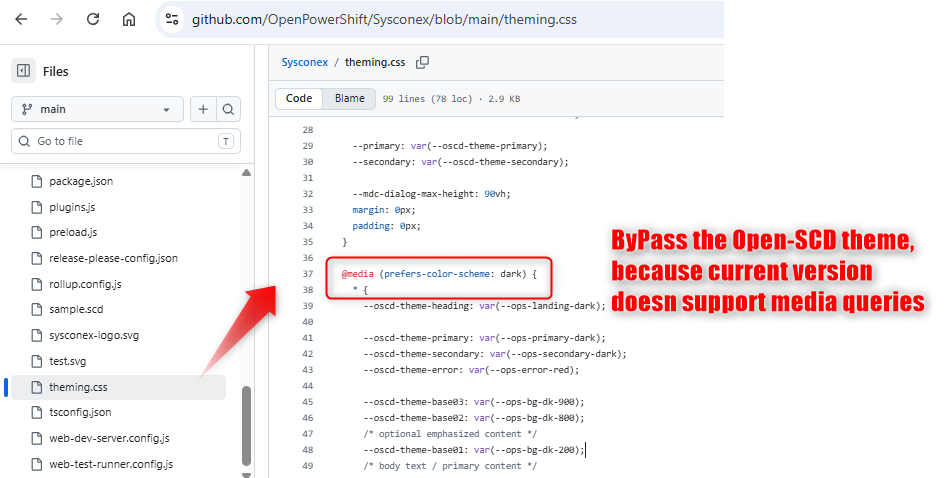
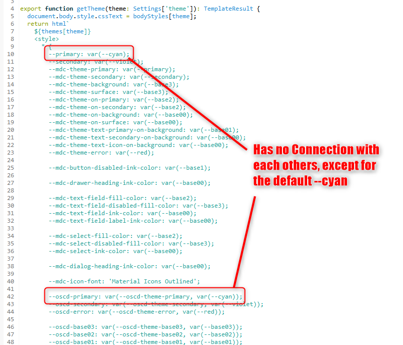

# ADR-0005 annex — CoMPAS host (`com-pas/open-scd`)

Date: 2026-08-21 (updated 2026-09-06)

This annex is the CoMPAS-specific work behind [ADR-0005](0005-customer-branding-and-dark-mode.md). Ecosystem terminology and the `--oscd-theme-*` fork live there. This file is the `themes.ts` / Settings / nav-token plan for https://github.com/com-pas/open-scd (and distros such as https://github.com/com-pas/compas-open-scd).

How-tos for this host (new with ADR-0005): [customer-branding.md](../how-to/customer-branding.md), [plugin-theming.md](../how-to/plugin-theming.md).

## Status

Proposed (implementation on the customer-branding branch)

## Dark mode is de facto not implementable

CoMPAS light/dark is a 1:1 [Solarized](https://ethanschoonover.com/solarized/) inversion: two stylesheets swap unprefixed `--base03` … `--base3`. That works only while nobody overrides the palette.

- A single hex on `--oscd-theme-base*` is used in both modes, so the split disappears.
- `--oscd-theme-primary` is a **fixed** fill for plugin UI **and** the app bar. A very dark brand color makes contrast text unreadable on that fill in one mode.
- `prefers-color-scheme` / CSS `light-dark()` do not follow the in-app theme switch. Settings never set `color-scheme`.

This annex makes light/dark work from the app switch (`color-scheme` + `light-dark()`), without requiring every token to be overridden. Settings become a three-way choice: **system default** (host default), **light**, **dark**.

**oscd-shell** distributions already brand with `@media (prefers-color-scheme)` (or `light-dark()`) and hide the in-app toggle — for example [OpenPowerShift/Sysconex `theming.css`](https://github.com/OpenPowerShift/Sysconex/blob/main/theming.css). That follows the **OS**, not an app flag.

## Wizard code view (Ace)

The wizard Ace editor picks a built-in Solarized file with hardcoded colors. That is a separate story: [ADR-0007](0007-ace-theme-oscd.md).

## Other host bugs

- `--oscd-primary` and `--primary` can diverge (`--primary` stayed `--cyan` when `--oscd-theme-primary` was set). Same for secondary. They must stay in sync.

  

- App bar / page background cannot be branded independently of plugin fills (`--oscd-theme-primary` / `--oscd-theme-base2`).

  

- `themes.ts` had a CSS syntax error at the MD3 text-field mappings (`/* textfield */ disabled-label-text-color`).

  

## Solutions

Keep this short. Token names and defaults are in the tables below.

- **Media queries follow the app.** Settings writes `document.documentElement.style.colorScheme` (`light`, `dark`, or `light dark`). CSS `light-dark()` and `@media (prefers-color-scheme)` then track the same flag.
- **Theme select:** System default / Light / Dark. Default is **system**, so a CoMPAS distro can follow the OS with `prefers-color-scheme` if it wants.
- **`themes.ts` follows oscd-shell** for compatibility: [`oscd-shell-design-tokens.ts`](https://github.com/OMICRONEnergyOSS/oscd-shell/blob/main/src/oscd-shell-design-tokens.ts). Small adds: icon font `'Material Symbols Outlined'`, `--oscd-theme-shape`, `--oscd-theme-warning`.
- **Old names stay for compatibility.** `--oscd-*` and unprefixed Solarized tokens (`--primary`, `--base03`, `--cyan`, …) are still set. Distros and new plugins brand with **`--oscd-theme-*`**. Do not treat `--oscd-*` as the branding API.
- **Split plugin-facing vs host-distribution branding.** Plugins read `--oscd-theme-primary`, bases, fonts, shape, and so on. App bar, tabs, and page background are host-distribution only (`--oscd-theme-nav-*`, `--oscd-theme-body-bg`).
- **How-tos** for customer branding and plugin development: [`docs/how-to/`](../how-to/customer-branding.md).

Hosts that set no `--oscd-theme-*` keep the current look. Status colors beyond error / warning: [ADR-0006](0006-customer-branding-add-status-color-tokens.md).

## New host-distribution branding tokens (`--oscd-theme-*`)

These are the tokens a distro sets in `customer-branding.css`. Plugins must **not** read the nav / body-bg ones. Distros may leave them unset.

| Branding token | Default (if unset) | Description | Theme |
|---|---|---|---|
| `--oscd-theme-nav-primary` | Solarized cyan | App-bar / tab fill. Host-distribution only. | Either |
| `--oscd-theme-nav-primary-active` | Solarized cyan | Active editor-tab fill. Host-distribution only. | Either |
| `--oscd-theme-nav-primary-text` | Solarized base2 | App-bar / tab ink. Host-distribution only. | Either |
| `--oscd-theme-nav-primary-text-active` | Solarized base2 | Active editor-tab indicator. Host-distribution only. | Either |
| `--oscd-theme-body-bg` | Solarized base2 | Page background; independent of plugin surfaces. Host-distribution only. | Light/Dark |

The host maps nav tokens to `--oscd-internal-nav-*` for `Layout.ts` / `menu-tabs.ts`. That prefix is host-distribution internals, not a plugin API.

*Theme:* Fixed = same in light and dark. Light/Dark = follows `color-scheme`. Either = leave fixed when contrast is enough (default cyan); use `light-dark()` when the brand color fails on paper.

## Changed variables (vs former com-pas/open-scd `main`)

**Brand with `--oscd-theme-*`.** `--oscd-*` and unprefixed Solarized names are filled from those tokens so old plugins keep working.

| Branding token | Former `main` | This branch | Compatibility alias (not the branding API) |
|---|---|---|---|
| `--oscd-theme-yellow` … `--oscd-theme-green` | unprefixed `--yellow` only | overridable `--oscd-theme-*` | `--oscd-yellow` … `--oscd-green`, `--yellow` … |
| `--oscd-theme-primary` / `--oscd-theme-secondary` | `--primary` stayed `--cyan` | distro sets `--oscd-theme-*` | `--oscd-primary` / `--oscd-secondary`, `--primary` / `--secondary` |
| `--oscd-theme-body-bg` | JS `bodyStyles` (`#eee8d5` / `#073642`) | CSS branding token | (none — host-distribution only) |
| Settings `theme` | `'light'` \| `'dark'` (default light) | `'system'` \| `'light'` \| `'dark'` (default system) | `color-scheme` on `<html>` |
| `--oscd-theme-shape` | unset | `8px` | `--oscd-shape`. Plugins map `--md-sys-shape-corner-*` (see Demo Theme). |
| `--oscd-theme-icon-font` | `'Material Icons'` | `'Material Symbols Outlined'` | `--oscd-icon-font`, `--mdc-icon-font` |
| `--oscd-theme-warning`, `--oscd-theme-text-font-mono` | unset / missing | aligned with oscd-shell | `--oscd-warning`, `--oscd-text-font-mono` |

## Theming default changes for distros

When a distro such as [CoMPAS](https://github.com/com-pas/compas-open-scd) bumps `@compas-oscd/open-scd`, look and behavior change even if the distro sets no `--oscd-theme-*` tokens.

`customer-branding.css` is **not** inside the published `@compas-oscd/open-scd` package. Unbranded distros keep the Solarized defaults from `themes.ts`. To brand, add your own CSS file and a `<link>` in **your** `index.html` — see [customer-branding.md](../../docs/how-to/customer-branding.md).

### What changes without branding CSS

| Change | Before | After | Distro impact |
|---|---|---|---|
| Settings default | `'light'` | `'system'` (OS `prefers-color-scheme`) | Users with no `localStorage.theme` (and after Reset) follow the OS. Stored `'light'` / `'dark'` stay. |
| Icon font | `--mdc-icon-font: 'Material Icons Outlined'` | `'Material Symbols Outlined'` | All MWC icons. The distro must keep shipping that font (CoMPAS already loads it). |
| App bar / tabs | `--primary` / `--oscd-theme-primary` | `--oscd-theme-nav-*` → `--oscd-internal-nav-*` | Setting `--oscd-theme-primary` no longer paints chrome. Unset nav tokens stay Solarized cyan. |
| Body background | JS `bodyStyles` hex | `color-scheme` + `light-dark()` | Page background follows the app theme / OS. |

To keep the old light-only default, users pick **Light** in Settings, or the distro ships branding CSS and does not rely on the previous implicit light theme.

### CSS features and browser years

The new theme path uses two CSS functions. **`light-dark()` is the gate.**

| Function | Cross-browser since | Engines | Role here |
|---|---|---|---|
| **`light-dark()`** | **Baseline 2024 (May 2024)** | Chrome/Edge 123, Firefox 120, Safari 17.5 | Solarized inversion and `color-scheme` theming. Distros need a 2024-era browser. |
| **`color-mix()`** | **May 2023** | Chrome 111, Firefox 113, Safari 16.2 | Disabled nav ink and optional darker mixes. Not the limiting factor. |

Older browsers ignore `light-dark()` values and will not invert the palette correctly.

